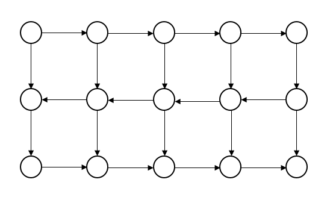
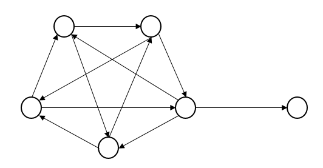
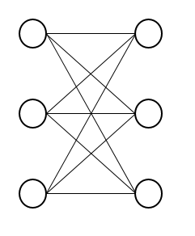

## Exercise 1.8

For a directed graph $G$, let's specify an arbitrary root $r$ and a directed spanning tree(arborescence) $T$ rooted at $r$, without loss of generality. Then we may construct the Eulerian circuit in this graph as follows:

> Starting at vertex $r$, each time choose an outgoing edge arbitrarily, while any edge specified in the above arborescence $T$ is avoided as long as possible.

In fact, in the construction above, we have $(d_{v}-1)!$ possible orderings for each vertex other than $r$. For $r$ we have $(d_r)!$ possible orderings, but in fact we've overcounted it $d_r$ times since the root is passed $d_r$ times.  Therefore, we may establish an $\prod\limits_{v}(d_{v}-1)!-1$  correspondence between the Eulerian circuits in a directed graph $G$ and the arborescences in $G$.

References: [Note on Counting Eulerian Circuits](http://www.cdam.lse.ac.uk/Reports/Files/cdam-2004-12.pdf),[Wikipedia: BEST theorem](https://en.wikipedia.org/wiki/BEST_theorem)

## Exercise 1.15

One valid Pfaffian orientation is to direct each vertical edge downwards, and direct each horizontal edge depending on the parity of its row number, as shown below:

One can easily see that in this way each cycle is oddly oriented.

## Exercise 1.16

A sample is shown below:

This graph is clearly non-planar, since it contains $K_5$ as a subgraph, and a Pfaffian orientation is given, which clearly shows that each even cycle is oddly oriented.

## Exercise 1.17

A trivial example is that $K_{3,3}$(classical non-planar graph,shown below) admits no Pfaffian orientation.

The proof can be done through some simple addition/subtraction of the parity of some of the even cycles, which is omitted here.